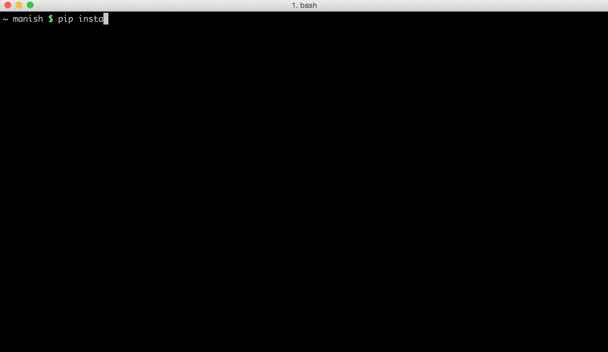

### Pysession

Automatically save python interpreter code to a file or secret Gist. You can turn this off for any session. Helpful when you want to share a piece of code you just hacked on the shell or wanted to save it in a file for use later. 

Tested with IPython, Python2 & Python3 default shells.



#### Installation steps

``` bash
pip install pysession
echo 'export PYTHONSTARTUP=$HOME/.pysession/pysession.py' >> ~/.bashrc
```

If you are using zsh replace `.bashrc` in the above line with `.zshrc` and similarly for any other shell. On macOS, you should append this to `~/.bash_profile`

#### How to use

By default, Pysession will record each shell run and save to a Gist. However it can be instructed to turn off recording or save to a file locally instead of GitHub.

##### To turn off saving for a session

``` python
>>> PySession.off()
```

Alternatively, to persist your choice of not saving sessions for some extended period of time, set an environment variable PYSESSION_SAVE_OFF to True. 
`export PYSESSION_SAVE_OFF=True`


##### To turn back on saving for a session

``` python
>>> PySession.on()
```


##### To save to a local file instead of Gist

``` python
>>> PySession.local()
```

To always save your sessions to local file, set an environment variable PYSESSION_SAVE_LOCALLY to True. 
`export PYSESSION_SAVE_LOCALLY=True`

The file is saved with a name `session.py` You can change this by setting the environment variable PYSESSION_FILENAME to your desired filename. 
`export PYSESSION_FILENAME=some_file_name.py`


